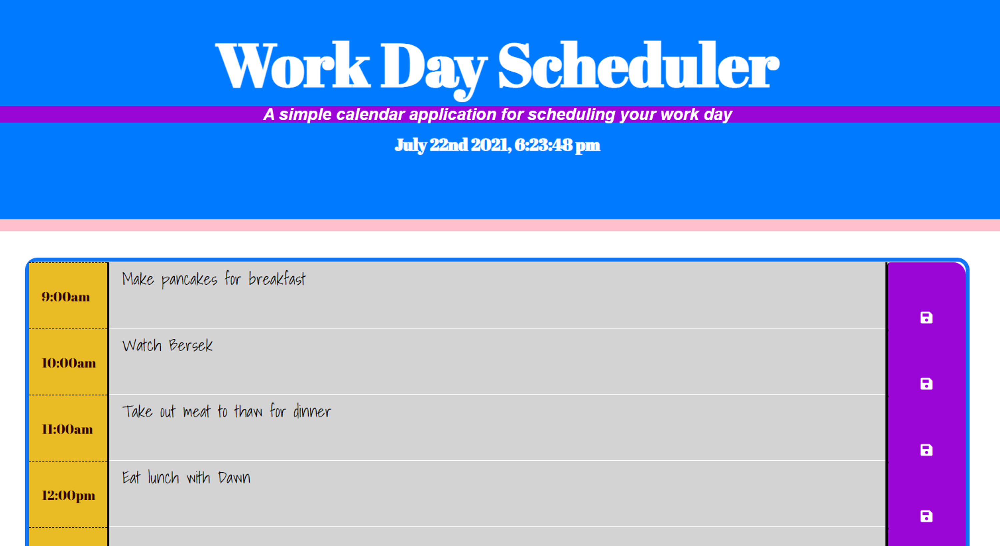

# Work-day-Scheduler-App
This app lets a user create a schedule that is organized hourly. 

## Description 
For this project, a workday scheduler app was made using some starter html code and bootstrap.
The app has time slots that allows the user to fill in tasks for the day by the hour.
The user should be able to save their edits (this is logged using local storage).
The app should also show the date and time for the current day.
At this stage of the development, there are some bugs that need to be fixed before it can function as it should. 

Here is the link to the app: (https://pnambao.github.io/Work-day-Scheduler-App/)

This is an example image of the page: 

## Credits
Chris Woolcott (https://github.com/cwoolcott)
Nate Perfettiful (https://github.com/perfettiful)
Philip Merriman (https://github.com/phillipmerriman)
​
## License
​Copyright (c) [2021] [PanjeNambao]

Permission is hereby granted, free of charge, to any person obtaining a copy
of this software and associated documentation files (the "Software"), to deal
in the Software without restriction, including without limitation the rights
to use, copy, modify, merge, publish, distribute, sublicense, and/or sell
copies of the Software, and to permit persons to whom the Software is
furnished to do so, subject to the following conditions:

The above copyright notice and this permission notice shall be included in all
copies or substantial portions of the Software.

THE SOFTWARE IS PROVIDED "AS IS", WITHOUT WARRANTY OF ANY KIND, EXPRESS OR
IMPLIED, INCLUDING BUT NOT LIMITED TO THE WARRANTIES OF MERCHANTABILITY,
FITNESS FOR A PARTICULAR PURPOSE AND NONINFRINGEMENT. IN NO EVENT SHALL THE
AUTHORS OR COPYRIGHT HOLDERS BE LIABLE FOR ANY CLAIM, DAMAGES OR OTHER
LIABILITY, WHETHER IN AN ACTION OF CONTRACT, TORT OR OTHERWISE, ARISING FROM,
OUT OF OR IN CONNECTION WITH THE SOFTWARE OR THE USE OR OTHER DEALINGS IN THE
SOFTWARE.
